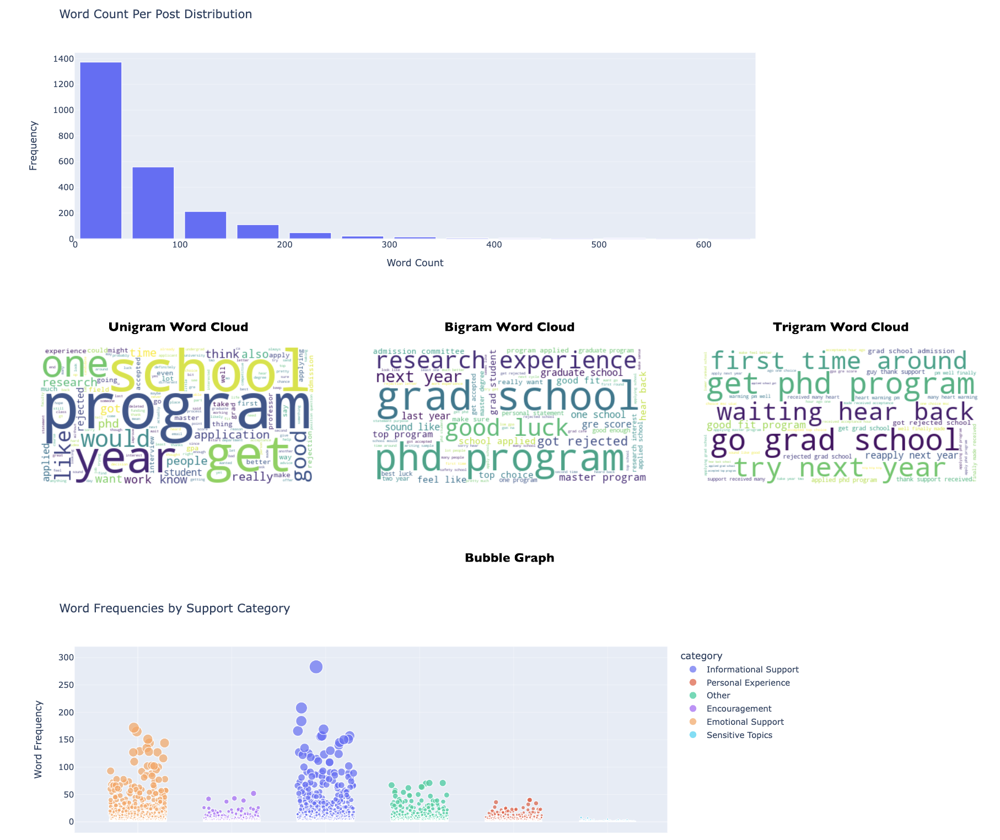

# Analyzing Support Dynamics in Academic Rejection on r/gradadmissions

## Project Overview

This project dives into the dynamics of competition and support within the r/gradadmissions community on Reddit. By analyzing rejection posts and comments, we aim to uncover key themes of community support, advice, shared experiences, and the general sentiment toward academic rejections. Our focus is on understanding how members of this online community interact around topics of rejection, providing both informative and emotional support.

## Motivation

The competitive atmosphere of graduate admissions can be daunting. This project was motivated by the desire to understand how individuals in the r/gradadmissions subreddit support each other through these challenging times. We were particularly interested in the ratio of positivity to negativity in responses, what kind of support (informative vs. emotional) is more prevalent, and the specific phrases or themes that embody the community's support system.

## Research Questions

Our research revolves around the following key questions:
- What are the main themes in the replies to rejection posts?
- Which type of support (informative or emotional) is more prevalent?
- What positive phrases do community members use to encourage each other?

## Methodology

We collected data from r/gradadmissions, focusing on posts related to academic rejections and the ensuing discussions. Our analysis includes:
- Histograms to analyze word count distribution in posts.
- Word clouds to identify common themes and phrases.
- Bubble graphs to compare the prevalence of informative support vs. emotional support.

## Results

Our findings reveal that:
- Most posts are brief, with fewer than 50 words, but there's a significant number of longer, detailed posts.
- Key phrases like "grad school," "good luck," and "try next year" suggest a focus on future planning and encouragement.
- Both informative and emotional supports are vital, with discussions ranging from practical advice about applications to expressions of empathy and understanding.

## How to Use This Project

To explore the dynamics of support in academic rejection on r/gradadmissions:
1. Clone this repository.
2. Follow the installation instructions below to set up the necessary environment.
3. Run the analysis scripts to generate your own visualizations and insights.

## Installation

### Steps to run the code
#### Step 1 - Go to the directory the file is downloaded in 
#### Step 2 - Type "python3 webapp.py" in the terminal 
#### Step 3 - Open a web browser and go to http://127.0.0.1:5000

## Support

For questions or support, please contact us at (hs58@illinois.edu).
